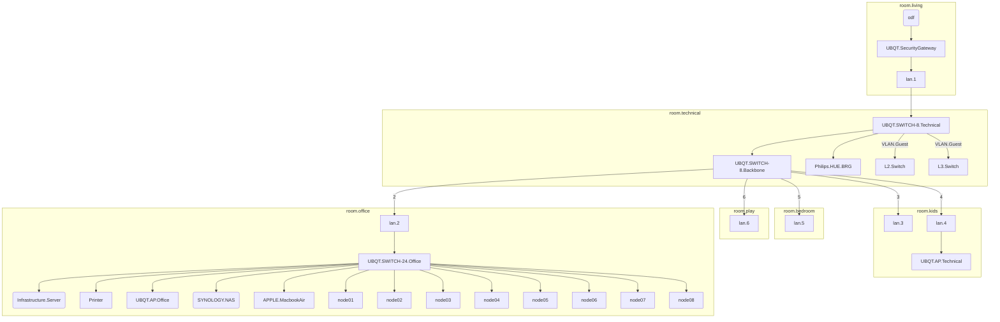

+++
title = "LAN topology"
tags = [
    "kubernetes",
    "cloud native",
    "development",
]
date = "2019-04-02"
toc = true
+++

```mermaid
graph TD
subgraph room.living
odf(odf)-->UBQT.SecurityGateway;
UBQT.SecurityGateway-->lan.1;
end
subgraph room.technical
lan.1-->UBQT.SWITCH-8.Technical
UBQT.SWITCH-8.Technical-->UBQT.SWITCH-8.Backbone
UBQT.SWITCH-8.Technical-->Philips.HUE.BRG
UBQT.SWITCH-8.Technical--VLAN.Guest-->L2.Switch;
UBQT.SWITCH-8.Technical--VLAN.Guest-->L3.Switch;
end
subgraph room.kids
UBQT.SWITCH-8.Backbone--3-->lan.3
UBQT.SWITCH-8.Backbone--4-->lan.4
lan.4-->UBQT.AP.Technical
end
subgraph room.bedroom
UBQT.SWITCH-8.Backbone--5-->lan.5
end
subgraph room.play
UBQT.SWITCH-8.Backbone--6-->lan.6
end
lan.2-->UBQT.SWITCH-24.Office
subgraph room.office
UBQT.SWITCH-8.Backbone--2-->lan.2
UBQT.SWITCH-24.Office-->Infrastructure.Server(Infrastructure.Server)
UBQT.SWITCH-24.Office-->Printer
UBQT.SWITCH-24.Office-->UBQT.AP.Office
UBQT.SWITCH-24.Office-->SYNOLOGY.NAS(SYNOLOGY.NAS)
UBQT.SWITCH-24.Office-->APPLE.MacbookAir
UBQT.SWITCH-24.Office-->node01
UBQT.SWITCH-24.Office-->node02
UBQT.SWITCH-24.Office-->node03
UBQT.SWITCH-24.Office-->node04
UBQT.SWITCH-24.Office-->node05
UBQT.SWITCH-24.Office-->node06
UBQT.SWITCH-24.Office-->node07
UBQT.SWITCH-24.Office-->node08
end

```